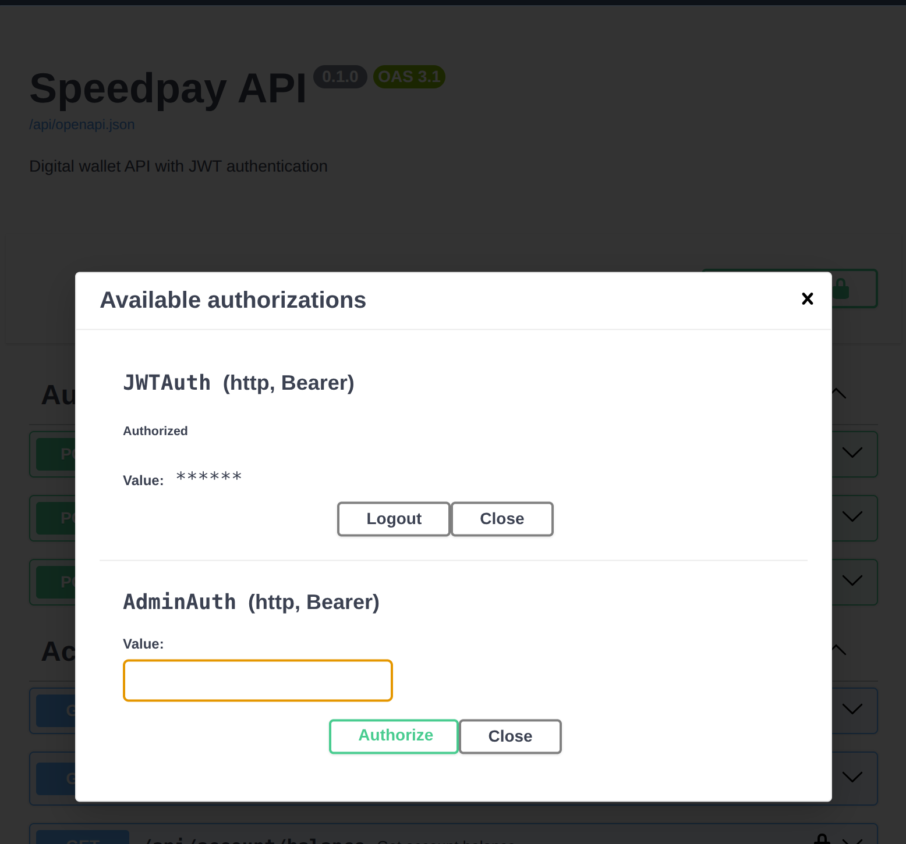

# Speedpay API

A digital wallet API built with Django Ninja and JWT authentication.

## Features

- User registration with automatic 6-digit account number
- JWT authentication (access + refresh tokens)
- Deposits via Paystack
- Withdrawals with balance validation
- Transfers between registered users (atomic, self-transfer rejected)
- Admin endpoint to view all users and balances
- Dockerized with PostgreSQL

## Environment Variables

| Variable | Required | Description |
|---|---|---|
| `SECRET_KEY` | Yes | Django secret key |
| `DATABASE_URL` | Yes | PostgreSQL connection string |
| `PAYSTACK_SECRET_KEY` | For deposits | Paystack secret key |
| `PAYSTACK_PUBLIC_KEY` | For deposits | Paystack public key |
| `DEBUG` | No | Defaults to `False` |

## Running Locally

### Prerequisites

- Docker and Docker Compose
- Python 3.13+ and uv (for local development without Docker)

### Quick Start (Docker)

```bash
bash scripts/setup.sh
```

This copies `.env.example` → `.env`, generates a `SECRET_KEY` if missing,
builds and starts the containers, waits for the app, creates an admin account,
and prints the credentials. Auth, withdrawals, and transfers work immediately.
Deposits work out of the box, as the script injects a Paystack test key for demo convenience.

The API will be available at `http://localhost:8000/api/docs`.

You can customize the admin account via environment variables:

```bash
ADMIN_EMAIL=jane@example.com ADMIN_PASS=hunter2 bash scripts/setup.sh
```

### Local Development (without Docker)

```bash
uv sync --group dev
cp .env.example .env
# Edit .env with your database credentials
python manage.py migrate
python manage.py runserver
```

## Testing Deposits

Deposits go through Paystack. Without Paystack keys, auth, withdrawals, and transfers still work fine.

1. Call `POST /api/account/deposit` to get `authorization_url` and `reference`.
2. Visit the URL and pay with Paystack test card `4084 0840 8408 4081`, any future expiry, CVV `408`.
3. Paystack fires the webhook and credits your balance.

## Quick Demo

```bash
# Register
curl -X POST http://localhost:8000/api/auth/register \
  -H "Content-Type: application/json" \
  -d '{"email": "alice@example.com", "password": "pass1234", "first_name": "Alice", "last_name": "A"}'

# Get token
curl -X POST http://localhost:8000/api/auth/token \
  -H "Content-Type: application/json" \
  -d '{"email": "alice@example.com", "password": "pass123"}'

# Check balance (use the access token from above)
curl http://localhost:8000/api/account/balance \
  -H "Authorization: Bearer <access_token>"

# Withdraw
curl -X POST http://localhost:8000/api/account/withdraw \
  -H "Authorization: Bearer <access_token>" \
  -H "Content-Type: application/json" \
  -d '{"amount": "500.00"}'

# Transfer to another user
curl -X POST http://localhost:8000/api/account/transfer \
  -H "Authorization: Bearer <access_token>" \
  -H "Content-Type: application/json" \
  -d '{"recipient_account_number": "123456", "amount": "200.00"}'
```

## API Documentation

Interactive docs: `/api/docs`

Protected endpoints require a JWT access token. To use them in Swagger:

1. Call `POST /api/auth/token` to get `{access, refresh}`.
2. Click the **Authorize** button at the top right of the Swagger page.
3. Paste the access token into the **JWTAuth** value field (no prefix needed).
4. Click **Authorize**, then **Close**.



### Auth -- `/api/auth/`

| Method | Path | Auth | Request Body | Response |
|--------|------|------|-------------|----------|
| POST | `/register` | None | `{email, password, first_name, last_name}` | `{id, email, number}` |
| POST | `/token` | None | `{email, password}` | `{access, refresh}` |
| POST | `/token/refresh` | None | `{refresh}` | `{access}` |

### Account -- `/api/account/` (JWT required)

| Method | Path | Request Body | Response |
|--------|------|-------------|----------|
| GET | `/balance` | — | `{balance}` |
| GET | `/transactions/{reference}` | — | `{reference, status, amount, type, paid_at, created_at}` |
| POST | `/deposit` | `{amount, callback_url?}` | `{authorization_url, reference}` |
| POST | `/withdraw` | `{amount}` | `{message, new_balance}` |
| POST | `/transfer` | `{recipient_account_number, amount}` | `{message, new_balance}` |

### Admin -- `/api/admin/` (JWT + admin required)

| Method | Path | Response |
|--------|------|----------|
| GET | `/users` | `[{id, email, first_name, last_name, is_admin, number, balance}]` |

### Webhooks -- `/api/webhooks/`

| Method | Path | Description |
|--------|------|-------------|
| POST | `/paystack` | Paystack payment callback |

## Tech Stack

- **Django 6** + **Django Ninja**
- **PostgreSQL**
- **ninja-jwt**
- **Paystack**
- **Uvicorn**
- **Docker**